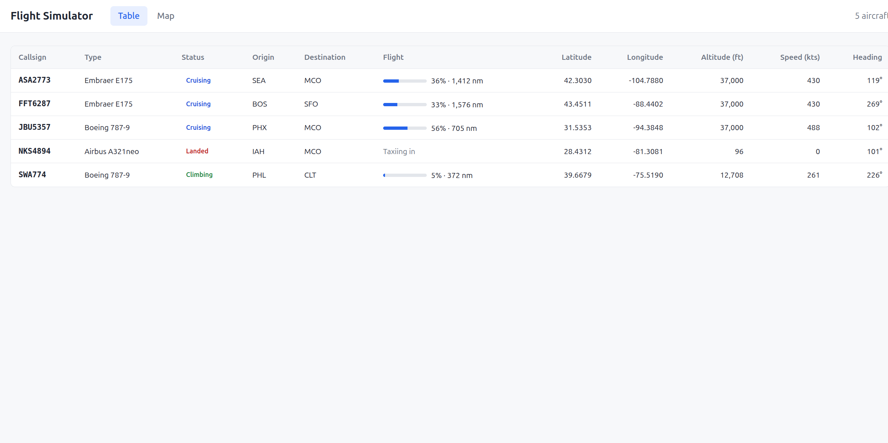
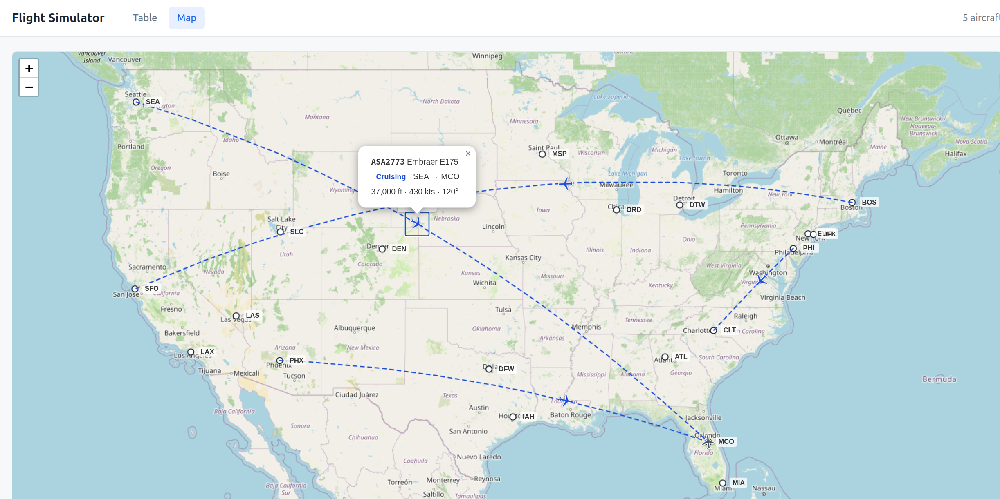

# Flight Simulator

## Overview

Flight Simulator is a full-stack web application that simulates airline traffic in
accelerated real time. A fleet of aircraft — with airline-style callsigns and real
types such as the Airbus A320, Boeing 737-800, and Boeing 787-9 — flies continuously
between twenty real-world airports, and a web UI shows the fleet's live position,
altitude, speed, heading, and flight progress.

The backend is a FastAPI service backed by PostgreSQL (schema managed with Alembic
migrations, which also seed the airport data). On startup it generates a fresh fleet
parked at random airports, each with a destination and a staggered departure
countdown. A pure-Python simulation engine then advances every aircraft once per tick
through its full flight cycle — departure, climb, cruise, descent, touchdown, taxi-in,
and turnaround — flying great-circle routes with a fixed climb rate, route-length-based
cruise altitudes up to FL370, a 3 nm per 1,000 ft descent profile, and speeds that ramp
between takeoff/landing speed and each type's cruise speed. Simulated time runs faster
than wall-clock time (30× by default) and is fully configurable, so a complete flight
takes minutes to watch instead of hours. The live fleet state is exposed through a REST
API with auto-generated OpenAPI docs.

The frontend is a React + TypeScript single-page app (built with Vite) that polls the
API every two seconds and presents the fleet in two views, shown below. Everything —
database, backend, and frontend — runs locally with a single `docker compose up`, with
hot reload on both tiers.

### Table View



### Map View



**Tech Stack:** FastAPI · SQLAlchemy · Alembic · PostgreSQL · React · Docker Compose

## Running locally

```bash
docker compose up -d
```

| Service  | URL                                   |
|----------|---------------------------------------|
| Web app  | http://localhost:5173                 |
| API      | http://localhost:8000/api/health      |
| API docs | http://localhost:8000/docs            |
| Postgres | localhost:5432 (flightsim/flightsim)  |

The backend and frontend sources are bind-mounted, so uvicorn and Vite reload when
you change the code. If port 5173 is taken, choose another host port with
`FRONTEND_PORT=5174 docker compose up` (or put `FRONTEND_PORT=5174` in a `.env` file).

## Simulation

On startup the backend replaces the fleet with `NUM_AIRCRAFT` aircraft parked at random
airports, each with a destination and a departure countdown. A background task then
advances every aircraft once per tick:

`on_ground` → `climbing` → `cruising` → `descending` → `landed` (taxi-in) → `on_ground`
at the arrival airport with a new destination.

Aircraft follow great-circle routes, climb at 2,500 ft/min, cruise at a type-specific
speed and an altitude based on route length (up to FL370), and descend on a 3 nm per
1,000 ft profile. The engine lives in `backend/app/simulation.py`.

| Setting (env var)    | Default | Meaning                                          |
|----------------------|---------|--------------------------------------------------|
| `NUM_AIRCRAFT`       | `5`     | Aircraft created at startup                      |
| `SIM_TIME_SCALE`     | `30`    | Simulated seconds per real second                |
| `SIM_TICK_SECONDS`   | `1`     | Real seconds between simulation ticks            |
| `SIMULATION_ENABLED` | `true`  | Set to `false` to freeze the fleet on the ground |

The simulation runs inside the API process, so run the backend with a single worker.
Times shown in the UI (for example "Departs in 12 min") are simulated time.

## Database migrations

Migrations run automatically (`alembic upgrade head`) when the backend container starts.
To create a new migration after changing the models:

```bash
docker compose exec backend alembic revision --autogenerate -m "describe change"
```

## Backend development

The backend uses [uv](https://docs.astral.sh/uv/) for dependency management and
[Ruff](https://docs.astral.sh/ruff/) for linting and formatting (configured in
`backend/pyproject.toml`).

```bash
cd backend
uv sync                      # create .venv with app + dev dependencies (for your editor)
uv run ruff check .          # lint
uv run ruff check --fix .    # lint and apply safe fixes
uv run ruff format .         # format
uv run pytest                # run tests (no database needed)
uv add <package>             # add a runtime dependency (updates uv.lock)
uv add --dev <package>       # add a dev-only dependency
```

After changing dependencies, rebuild the image with `docker compose up --build`.
Inside the container the virtualenv lives at `/opt/venv`, so commands such as
`docker compose exec backend ruff check .` and `docker compose exec backend pytest`
also work.
Migrations generated with `alembic revision --autogenerate` are automatically
linted and formatted with Ruff.

## Frontend development

The frontend is React + TypeScript, built with [Vite](https://vite.dev/). In development
the Vite server forwards `/api` requests to the backend.

```bash
cd frontend
npm install        # install dependencies locally (for your editor)
npm run lint       # ESLint
npm run build      # type-check and build for production
```

The container keeps its own `node_modules` in an anonymous volume. After adding or
upgrading npm packages, rebuild it and renew that volume:

```bash
docker compose up --build -V frontend
```

The Map view uses [Leaflet](https://leafletjs.com/) with OpenStreetMap tiles, so it
needs internet access to load the map background.
